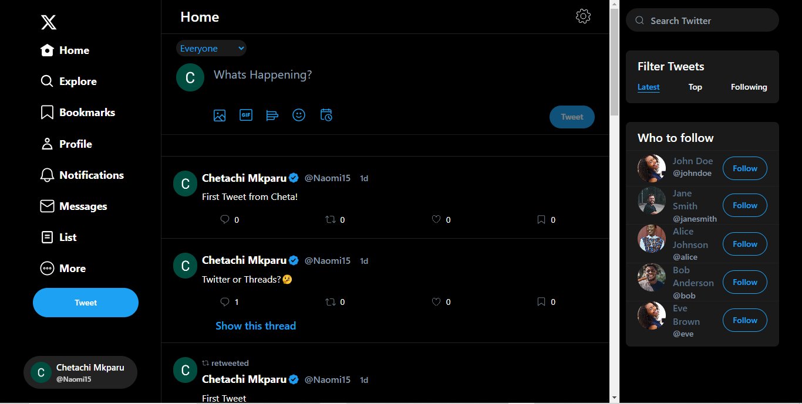
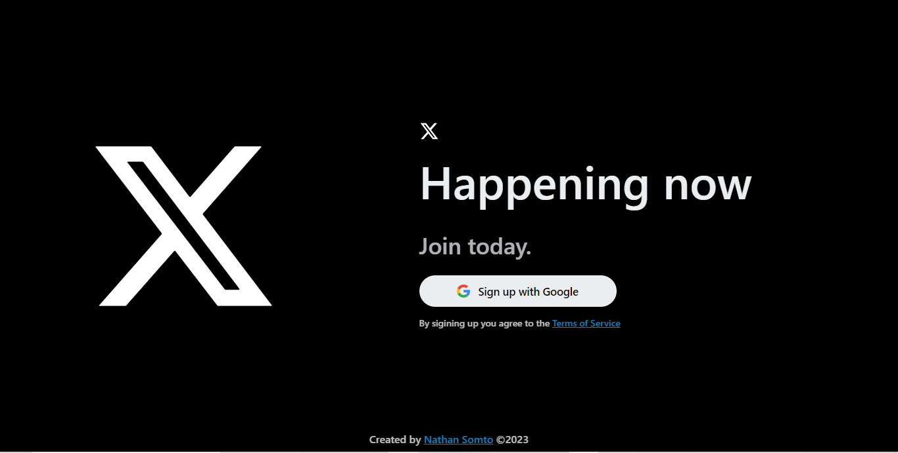
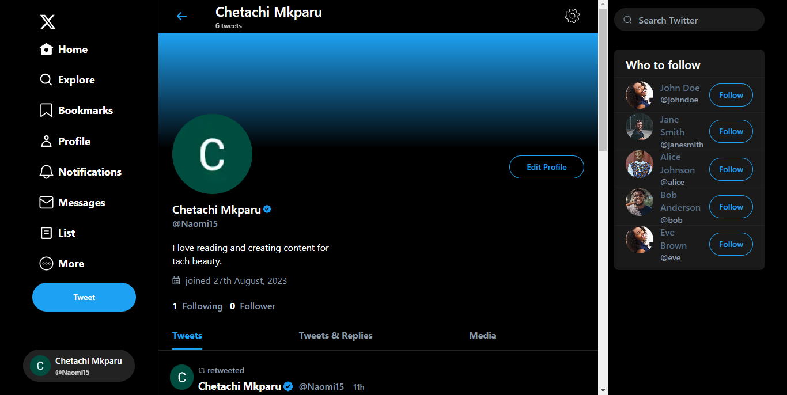
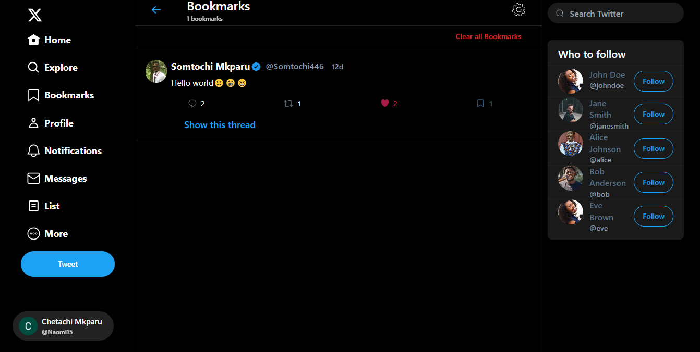
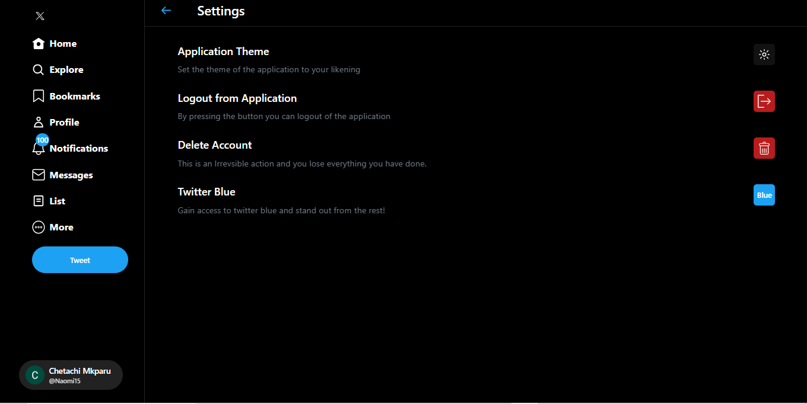

<div align="center">

 <svg viewBox="0 0 24 24" height="70"  width="70" aria-hidden="true">
            <g>
              <path d="M18.244 2.25h3.308l-7.227 8.26 8.502 11.24H16.17l-5.214-6.817L4.99 21.75H1.68l7.73-8.835L1.254 2.25H8.08l4.713 6.231zm-1.161 17.52h1.833L7.084 4.126H5.117z"></path>
            </g>
      </svg>


# Fullstack Twitter Web Clone

<div align="center">


</div>

<div align="center">
    <a href="https://twitter-clone.vercel.app/">View Demo</a>
  <span> · </span>
    <a href="https://github.com/Nathan-Somto/Twitter-Clone/blob/main/README.md">Documentation</a>
  <span> · </span>
    <a href="https://github.com/Nathan-Somto/Twitter-Clone/issues">Report Bug</a>
  <span> · </span>
    <a href="https://github.com/Nathan-Somto/Twitter-Clone/pulls">Request Feature</a>
  </div>

  A Fullstack Twitter web app clone built with the `MERN` stack and `Next js` as the Fullstack framework.

</div>

**Password for Twitter Blue: `spaceX`**


## :thinking:  Reason For Project

I wanted to challenge myself and see how long it would take me to create and complete a full stack project. initially i wanted to use firebase as the backend but i felt that would have been a cheap and easy way out.

**Why I did not use the App router ?**

1. Most Next js codebases are still in the Page Router, so it pays to soildify your knowledge in the workings of the page router.

2. My laptop is too slow for the App router some how. if you really want this project to be in the App router here is a challenge for you rewrite the codebase.


## :star: Features
- [x] user authentication with google.
- [x] user profile
- [x] creation, ability to edit tweet visibility and deletion of tweets
- [x] image upload functionality for tweets, profile image and banner.
- [x]  retweeting
- [x] adding comments to tweets.
- [x] replying commments to tweets.
- [x]  user's profile search
- [x] bookmarking tweets
- [x]  liking tweets
- [x]  personalized tweet feed.
- [x]  follow user  functionality
- [x] user follow suggestions
- [x]  notifications
- [x] custom api
- [x] user verification (check readme for password)

## :camera: Screen Shots
[Figma file link](https://www.figma.com)

### Home Page


### Sign in Page


### Tweet Details Page

### User Profile Page


### Bookmark Page


### Settings Page


### Search Page

### Onboarding Page

## :hammer_and_wrench: Tech Stack

### :computer: Front End
- React (Ui Library)
- Shadcn Ui (Components Library)
- Tailwind Css (Css Framework)
- Framer Motion (Animation Library)
- Next js (Meta Framework)
- Redux (State Management)
- Redux Toolkit (So as not to suffer, like who writes plain redux these days?)


### :desktop_computer: Back End
-  Next Auth (Authentication Handler)
- Uploadthing (Media Uploader)
- Node js runtime
- Mongoose (Object Data Modeler)
- Next js (Full Stack Meta Framework)
- Zod (Schema Validator)
- Mongodb (NoSql Database)

## :key: Enviroment Variables
 **Add the following environment variables unless the app will not work as intended.**

 `MONGO_URL`

 `GOOGLE_CLIENT_ID`

 `GOOGLE_CLIENT_SECRET`

 `JWT_SECRET`

 `NEXTAUTH_URL`

 `UPLOADTHING_SECRET`

 `UPLOADTHING_APP_ID`

 `SITE_URL`
 
  `TWITTER_BLUE`
## :gear: Installation
1. Clone the Repository  

```
    $ git clone https://github.com/nathan-somto/twitter-clone.git
```

2. Enter into the directory

```
    $ cd Twitter-Clone
```

3. Create .env file at the root of project : ***Important Step Get all your credentials from google and uploadthing.***

```
  $ touch .env
```
4. Install all dependencies

```
   $ npm install
```

5.  Start the Development Server

```
    $ npm run dev
```
## 🐞 Issue Guidelines
1. **Search First**: Check if your issue already exists before creating a new one.

2. **Clear Title**: Use a concise title that describes the problem or request.

3. **Details Matter**: Provide clear details, steps to reproduce, and expected outcomes.

4. **Be Respectful**: Keep discussions polite and on-topic.

5. **Stay Updated**: Follow your issue for updates and respond promptly when needed.

## 👥 Contributors

[Nathan Somto](https://www.github.com/Nathan-Somto)